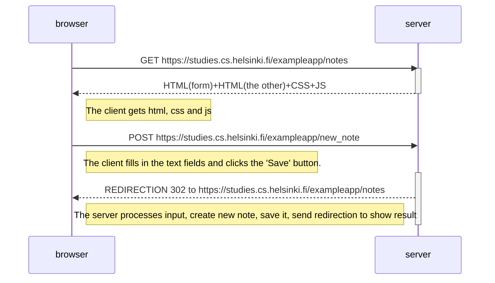

```mermaid
sequenceDiagram
    participant browser
    participant server

    browser->>server: GET https://studies.cs.helsinki.fi/exampleapp/notes
    activate server
    server-->>browser: HTML(form)+HTML(the other)+CSS+JS
    deactivate server
    Note right of browser: The client gets html, css and js

    browser->>server: POST https://studies.cs.helsinki.fi/exampleapp/new_note
    Note right of browser: The client fills in the text fields and clicks the 'Save' button.

    activate server
    server-->>browser: REDIRECTION 302 to https://studies.cs.helsinki.fi/exampleapp/notes
    Note left of server: The server processes input, create new note, save it, send redirection to show result
    deactivate server
```
