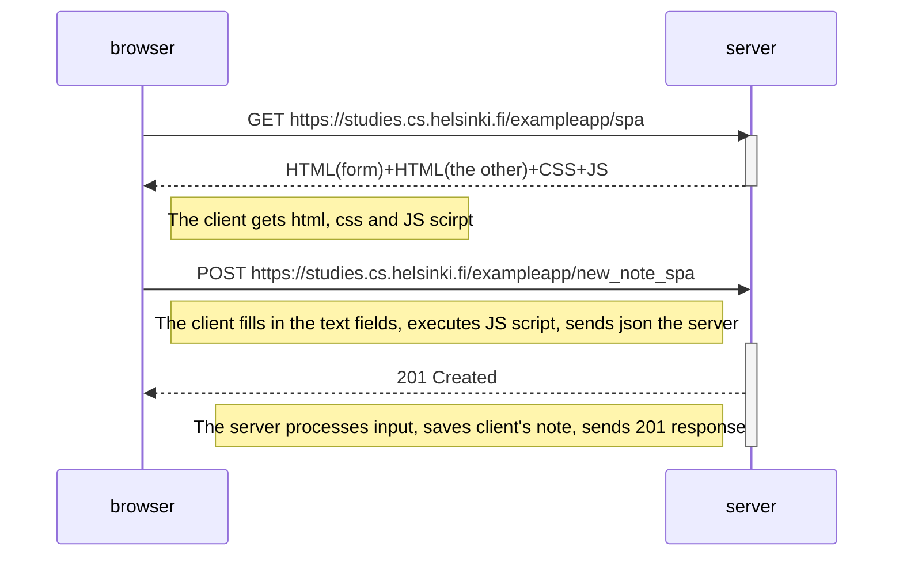

```mermaid
sequenceDiagram
    participant browser
    participant server

    browser->>server: GET https://studies.cs.helsinki.fi/exampleapp/spa
    activate server
    server-->>browser: HTML(form)+HTML(the other)+CSS+JS
    deactivate server
    Note right of browser: The client gets html, css and JS scirpt

    browser->>server: POST https://studies.cs.helsinki.fi/exampleapp/new_note_spa
    Note right of browser: The client fills in the text fields, executes JS script, sends json the server

    activate server
    server-->>browser: 201 Created
    Note left of server: The server processes input, saves client's note, sends 201 response
    deactivate server
```
